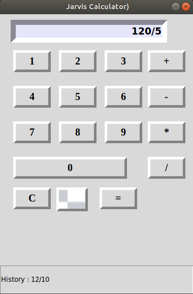
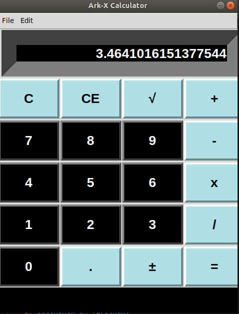

# Calculator-APP
Simple calculator applications using Tkinter library.

1) Calculator.py <> This calculator with simple GUI can also show the history of calculations made.

2) Scientific Calulcator <> This calculator with modified GUI can do almost all the calculations.

